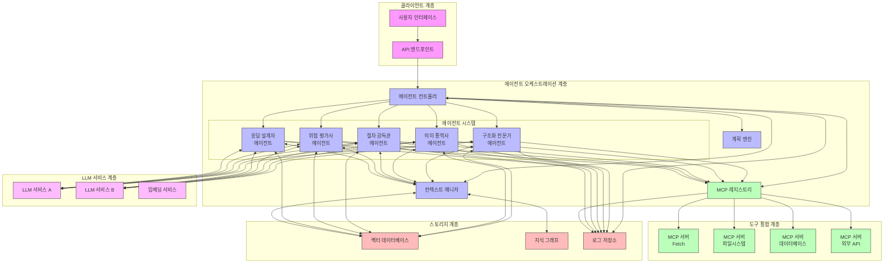

# AI Agent Architecture

```mermaid
flowchart TB
    subgraph "클라이언트 계층"
        UI[사용자 인터페이스]
        API[API 엔드포인트]
    end
    
    subgraph "에이전트 오케스트레이션 계층"
        AC[에이전트 컨트롤러]
        
        subgraph "에이전트 시스템"
            A1[구조화 전문가<br>에이전트]
            A2[의미 통역사<br>에이전트]
            A3[절차 감독관<br>에이전트]
            A4[위험 평가사<br>에이전트]
            A5[응답 설계자<br>에이전트]
        end
        
        MCP_REG[MCP 레지스트리]
        PLAN[계획 엔진]
        CTX[컨텍스트 매니저]
    end
    
    subgraph "도구 통합 계층"
        MCP_S1[MCP 서버<br> Fetch ]
        MCP_S2[MCP 서버<br> 파일시스템 ]
        MCP_S3[MCP 서버<br> 데이터베이스 ]
        MCP_S4[MCP 서버<br> 외부 API ]
    end
    
    subgraph "LLM 서비스 계층"
        LLM1[LLM 서비스 A]
        LLM2[LLM 서비스 B]
        EMB[임베딩 서비스]
    end
    
    subgraph "스토리지 계층"
        VDB[ 벡터 데이터베이스 ]
        KG[ 지식 그래프 ]
        LOGS[ 로그 저장소 ]
    end
    
    UI --> API
    API --> AC
    
    AC --> A1 & A2 & A3 & A4 & A5
    AC <--> PLAN
    AC <--> CTX
    AC <--> MCP_REG
    
    A1 & A2 & A3 & A4 & A5 <--> CTX
    A1 & A2 & A3 & A4 & A5 <--> LLM1 & LLM2
    
    MCP_REG --> MCP_S1 & MCP_S2 & MCP_S3 & MCP_S4
    
    A1 & A2 & A3 & A4 & A5 --> MCP_REG
    
    A1 & A2 & A3 & A4 & A5 <--> VDB
    CTX <--> VDB
    CTX <--> KG
    
    AC --> LOGS
    A1 & A2 & A3 & A4 & A5 --> LOGS
    MCP_REG --> LOGS
    
    classDef client fill:#f9f,stroke:#333,stroke-width:1px
    classDef agent fill:#bbf,stroke:#333,stroke-width:1px
    classDef mcp fill:#bfb,stroke:#333,stroke-width:1px
    classDef llm fill:#fbf,stroke:#333,stroke-width:1px
    classDef storage fill:#fbb,stroke:#333,stroke-width:1px
    
    class UI,API client
    class AC,A1,A2,A3,A4,A5,PLAN,CTX agent
    class MCP_REG,MCP_S1,MCP_S2,MCP_S3,MCP_S4 mcp
    class LLM1,LLM2,EMB llm
    class VDB,KG,LOGS storage
```