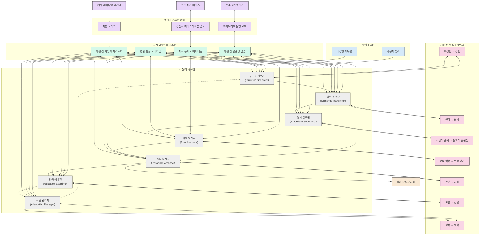

# Manual-based AI response system dimension conversion model

```mermaid
flowchart TB
    subgraph "차원 변환 프레임워크"
        D1["비정형 → 정형"]
        D2["언어 → 의미"]
        D3["시간적 순서 → 절차적 일관성"]
        D4["상황 맥락 → 위험 평가"]
        D5["판단 → 응답"]
        D6["모델 → 현실"]
        D7["정적 → 동적"]
    end
    
    subgraph "AI 협력 시스템"
        SS["구조화 전문가\n(Structure Specialist)"]
        SI["의미 통역사\n(Semantic Interpreter)"]
        PS["절차 감독관\n(Procedure Supervisor)"]
        RA["위험 평가사\n(Risk Assessor)"]
        RC["응답 설계자\n(Response Architect)"]
        VE["검증 심사관\n(Validation Examiner)"]
        AM["적응 관리자\n(Adaptation Manager)"]
    end
    
    subgraph "지식 업데이트 시스템"
        MR["차원 간 매핑 레지스트리"]
        QM["변환 품질 모니터링"]
        KS["지식 동기화 메커니즘"]
        CV["차원 간 일관성 검증"]
    end
    
    subgraph "레가시 시스템 통합"
        DB["차원 브리지"]
        MP["점진적 마이그레이션 경로"]
        HO["하이브리드 운영 모드"]
    end
    
    subgraph "데이터 흐름"
        M[비정형 매뉴얼] --> SS
        UI[사용자 입력] --> SI
        SS --> D1
        SI --> D2
        PS --> D3
        RA --> D4
        RC --> D5
        VE --> D6
        AM --> D7
    end
    
    %% AI 협력 시스템과 차원 변환 연결
    D1 <--> SS
    D2 <--> SI
    D3 <--> PS
    D4 <--> RA
    D5 <--> RC
    D6 <--> VE
    D7 <--> AM
    
    %% AI 협력 시스템 간 관계
    SS --> SI
    SI --> PS
    PS --> RA
    RA --> RC
    RC --> VE
    VE -.-> AM
    AM -.-> SS
    
    %% 지식 업데이트 시스템 연결
    MR <--> SS & SI & PS & RA & RC & VE & AM
    QM <--> SS & SI & PS & RA & RC & VE & AM
    KS <--> SS & SI & PS & RA & RC & VE & AM
    CV <--> SS & SI & PS & RA & RC & VE & AM
    
    %% 레가시 시스템 통합
    DB <--> MR
    MP <--> KS
    HO <--> CV
    
    %% 외부 시스템 연결
    LS[레가시 매뉴얼 시스템] <--> DB
    ES[기업 지식 베이스] <--> MP
    IS[기존 인터페이스] <--> HO
    
    %% 최종 출력
    RC --> R[최종 사용자 응답]
    
    classDef dimension fill:#f9d5e5,stroke:#333,stroke-width:1px
    classDef agent fill:#eeeeee,stroke:#333,stroke-width:1px
    classDef knowledge fill:#d5f9e9,stroke:#333,stroke-width:1px
    classDef legacy fill:#e9d5f9,stroke:#333,stroke-width:1px
    classDef data fill:#d5e9f9,stroke:#333,stroke-width:1px
    classDef output fill:#f9e9d5,stroke:#333,stroke-width:1px
    
    class D1,D2,D3,D4,D5,D6,D7 dimension
    class SS,SI,PS,RA,RC,VE,AM agent
    class MR,QM,KS,CV knowledge
    class DB,MP,HO,LS,ES,IS legacy
    class M,UI,R data
    class R output
```

